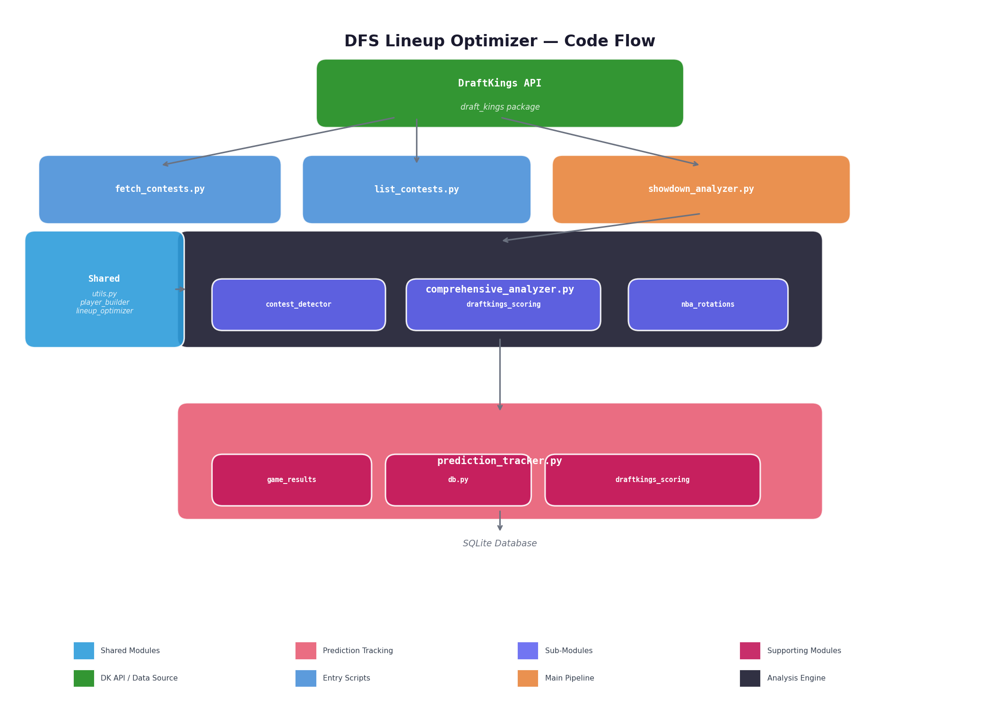

# DFS Lineup Optimizer

DraftKings daily fantasy sports lineup prediction and optimization scripts.

## Setup

```bash
uv venv
.venv\Scripts\activate
uv sync
```

## Code Flow



### Shared Modules

| Module | Purpose |
|--------|---------|
| `utils.py` | `MultiOutput`, `SALARY_CAP`, `display_scoring_rules()`, `run_and_save()`, `get_draftkings_client()` |
| `player_builder.py` | Unified player creation with CPT/UTIL dedup, stat-line matching, rotation metadata, dynamic fallback projections |
| `lineup_optimizer.py` | Optimal lineup generation via combinatorial enumeration (showdown) and pydfs (classic); deep bench exclusion & min fppg filtering |

### Data Flow

#### Pre-game (Predictions)

1. **DraftKings API** → Fetch contests, draftable players, and draft group data (with retry logic via `get_draftkings_client()`)
2. **contest_detector.py** → Classifies each contest as CLASSIC or SHOWDOWN
3. **draftkings_scoring.py** → Calculates fantasy points using official DK scoring rules; dynamic projections via `generate_projections_from_salary()` and `generate_projections_from_rotation()`
4. **nba_rotations.py** → NBA depth charts + actual last-15-games MPG for rotation-aware analysis
5. **player_builder.py** → Creates deduplicated Player objects with fppg, rotation metadata, and minutes data; falls back to rotation-aware salary-based projections when no stat-line match exists
6. **lineup_optimizer.py** → Exhaustive enumeration of all valid (CPT + 5 UTIL) combinations within salary cap; excludes deep bench and low-fppg punt plays
7. **showdown_analyzer.py** → Main pipeline: finds highest-entry contest, uses player_builder + lineup_optimizer

#### Post-game (Verification)

1. **game_results.py** → Confirms game was played (nba_api scoreboard → box score → StatMuse scrape), fetches box scores from nba_api (primary) and StatMuse (secondary), cross-verifies and merges data
2. **draftkings_scoring.py** → Calculates actual DK fantasy points from box score stats
3. **prediction_tracker.py** → Compares projected vs actual: runs game confirmation, fetches results, displays lineup comparison, finds theoretical best lineup, saves everything to SQLite
4. **db.py** → SQLite database for persistent tracking of games, player performances, and lineups across contests

## Usage

### Typical Workflow

```
1. List contests          → find the draft group / contest ID
2. Run showdown analyzer  → generate optimal lineups for the game
3. (After game) Run tracker → compare predictions vs actual results
```

### 1. List Upcoming Contests

```bash
python dfs_lineup_optimizer/list_contests.py
```

Finds the NBA Showdown contest with the most entries and displays contest details.

### 2. Showdown Analyzer (Generate Lineups)

```bash
# Auto-select highest-entry showdown contest
python dfs_lineup_optimizer/showdown_analyzer.py

# Specify a draft group ID
python dfs_lineup_optimizer/showdown_analyzer.py 148630
```

**Output:**
- Selects the showdown contest with the most entries
- Deduplicates CPT/UTIL player entries (keeps base salary)
- Generates 5 **optimal** lineups via combinatorial enumeration (guaranteed best within search space)
- **Excludes deep bench** players (role='none') from all lineups
- **Excludes low-production punt plays** (min fppg < 7.0) with inflated value ratios
- Player value rankings sorted by adjusted value (minutes-weighted)
- Role-separated views: Starters (30+ min), Rotation (18-25 min), Deep Bench (<10 min)
- Captain optimization analysis prioritizing starters by adjusted value
- Results saved to `dfs_lineup_optimizer/output/`

### 3. Prediction Tracker (After Game)

```bash
# Run tracker for a specific game
python dfs_lineup_optimizer/prediction_tracker.py --away SAS --home NYK --date 2026-06-10

# View history or summary
python dfs_lineup_optimizer/prediction_tracker.py --history
python dfs_lineup_optimizer/prediction_tracker.py --summary

# Specific player accuracy
python dfs_lineup_optimizer/prediction_tracker.py --player "Jalen Brunson"
```

**Flow:**
1. Confirms game was played (nba_api scoreboard → box score → StatMuse)
2. Fetches box score from nba_api (primary), StatMuse (secondary)
3. Cross-verifies stats between sources, merges best data
4. Displays actual DK fantasy points for all players
5. Finds theoretical best lineup from actual results
6. Saves everything to SQLite database

### 4. Fetch Contests (Low-level)

```bash
python dfs_lineup_optimizer/fetch_contests.py
```

### 5. Comprehensive Analysis (Alternative)

```bash
python dfs_lineup_optimizer/comprehensive_analyzer.py
```

## Scoring Rules

### DK NBA Base Scoring

| Stat                | Points  |
|---------------------|---------|
| Points              | +1.0    |
| Rebounds             | +1.25   |
| Assists              | +1.5    |
| Steals               | +2.0    |
| Blocks               | +2.0    |
| Turnovers            | -0.5    |
| 3-Pointers Made      | +0.5    |
| Double-Double        | +1.5    |
| Triple-Double        | +3.0    |

### Showdown Rules

- **Roster**: 6 players (1 Captain + 5 UTIL)
- **Captain**: 1.5x multiplier on BOTH points AND salary
- **Salary Cap**: $50,000

### Classic Rules

- **Roster**: 8 players (PG/SG/SF/PF/C positions)
- **Salary Cap**: $50,000

## Minutes & Value System

The showdown analyzer uses a **minutes-prioritized value system**:

- **Actual MPG**: Last-15-games minutes per game from Basketball-Reference/LandOfBasketball (for NYK/SAS players in tonight's game)
- **Role-based estimates**: For other teams, minutes are estimated from rotation role (starters ~33 min, rotation ~21 min, bench ~8 min) with salary-based adjustments for star starters
- **Adjusted Value** = `raw_value × (0.4 + 0.6 × minutes_weight)` — starters with high minutes get full weight, low-minute bench players get heavily discounted
- **Captain candidates**: Starters only (highest floor & ceiling for the captain 1.5x multiplier)

## Lineup Generation

The optimizer uses **exhaustive combinatorial enumeration**:

- For each captain candidate (~8-15 starters), enumerate all C(20, 5) = 15,504 utility combinations
- Filter by salary cap ($50,000)
- Return top-N lineups by total projected fppg
- Total search space: ~232,500 combinations — trivial for Python, guarantees optimal results

Previous greedy heuristics could miss better combinations that mix expensive + cheap players.

## Lineup Generation Rules

1. **CPT/UTIL deduplication** — DK lists each player twice (CPT at 1.5x salary, UTIL at base salary); keep the UTIL entry
2. **Injured players filtered out**
3. **Captain candidates** — starters only, sorted by adjusted value
4. **Deep bench excluded** — players with role='none' (no rotation role) are excluded from both captain and utility pools
5. **Minimum fppg threshold** — utility players must project ≥ 7.0 fppg; filters out low-production minimum-salary punt plays with artificially inflated value ratios
6. **Salary cap enforced** — all lineups validated to be under $50,000
7. **Rotation data** — starters prioritized via `nba_rotations.py`
8. **Dynamic projections** — when no stat-line match exists, uses rotation-aware salary-based projections instead of flat `salary/1000`

### Why Exclude Deep Bench & Low-fppg Players?

Minimum-salary players ($1,000) always show inflated raw value (e.g., 5 fppg ÷ $1k = 5.0X) because the denominator is tiny. A starter like Brunson at $10,600 with 47.2 fppg = 4.5X looks "worse" by raw value despite producing 9× more points. The minutes-weighted adjustment helps but doesn't fully solve it — `min_util_fppg=7.0` ensures only players with real DFS production make it into lineups.

## Prediction Tracking

After games are played, the prediction tracker compares projected vs actual performance:

- **Game confirmation** — verifies the game was actually played before fetching results (nba_api scoreboard → box score fallback → StatMuse)
- **Multi-source verification** — fetches box scores from nba_api (primary) and StatMuse (secondary), cross-verifies and merges data
- **Lineup-by-lineup comparison** — projected vs actual fppg for each captain/utility slot
- **Theoretical best lineup** — finds the optimal lineup from actual game results using combinatorial optimizer
- **Efficiency score** — ratio of our best predicted lineup to the theoretical best
- **SQLite database** — tracks results across multiple games for long-term accuracy analysis

### Historical Results (NYK vs SAS 2026 NBA Finals)

| Game | Date | Matchup | Best Predicted | Best Possible | Efficiency |
|------|------|---------|----------------|----------------|------------|
| Game 1 | 2026-06-03 | NYK @ SAS | — | 249.8 fppg | — |
| Game 2 | 2026-06-05 | NYK @ SAS | 209.8 fppg | 253.2 fppg | 82.8% |
| Game 3 | 2026-06-08 | SAS @ NYK | 182.9 fppg | 240.4 fppg | 76.0% |
| Game 4 | 2026-06-10 | SAS @ NYK | 226.1 fppg | 250.0 fppg | 90.5% |

**Key learnings from tracking:**
- **OG Anunoby** was the Game 4 hero: projected 32.5, actual 46.5 (+14.0) — 7 threes including the game-winner
- **Jalen Brunson CPT** was the best lineup pick in Game 4: projected 219.0, actual 226.1 (+3.3%) — only lineup to exceed projection
- **Jordan Clarkson** has been a consistent bust: projected 15.2, actual 2.2 in Game 4 (-12.9)
- **KAT** underperformed in Game 4: projected 47.2, actual 29.0 (-18.2)
- Game 4 achieved **90.5% efficiency** — best yet, driven by Brunson CPT + Anunoby's breakout
- Starter captains outperform cheap captains in high-variance playoff games

## Tests

```bash
python -m pytest dfs_lineup_optimizer/tests/ -v
```

65 tests covering DK scoring, contest detection, StatMuse parsing, game confirmation, box score verification, and prediction tracker flow.

## Output

Results are saved to `dfs_lineup_optimizer/output/` with timestamps. Example filename:

```
nba_showdown_2026-06-10_004221.txt
```

## Scripts

| Script | Description |
|--------|-------------|
| `showdown_analyzer.py` | Main pipeline: finds highest-entry showdown contest, generates optimal lineups |
| `list_contests.py` | List upcoming NBA contests ranked by entries |
| `prediction_tracker.py` | Compare predictions to actual results; multi-source verification (nba_api + StatMuse) |
| `game_results.py` | Fetch NBA box scores via nba_api + StatMuse; game confirmation and cross-verification |
| `comprehensive_analyzer.py` | Alternative analysis with DB tracking for both contest types |
| `fetch_contests.py` | Low-level: fetch contest and player data from DraftKings API |
| `db.py` | SQLite database module for persistent tracking across games |
| `contest_detector.py` | Contest type detection and rules (Classic vs Showdown) |
| `draftkings_scoring.py` | DK scoring calculator, stat lines, and dynamic projections |
| `nba_rotations.py` | NBA depth charts + last-15-games MPG (2025-26 season) |
| `player_builder.py` | Unified player creation with dedup and rotation metadata |
| `lineup_optimizer.py` | Optimal lineup generation (combinatorial for showdown, pydfs for classic) |
| `utils.py` | Shared utilities: output, scoring rules, API client |
| `projections.py` | Projection data integration and value play analysis |

### Test Suite

| File | Tests | Coverage |
|------|-------|----------|
| `tests/test_draftkings_scoring.py` | 11 | DK scoring calculations, bonuses, edge cases |
| `tests/test_contest_detector.py` | 14 | Showdown/Classic detection, contest info |
| `tests/test_game_results.py` | 23 | Name normalization, StatMuse URL/parsing, cross-verification, HTML parsing |
| `tests/test_prediction_tracker.py` | 17 | Game confirmation, lineup comparison, best lineup, game info flow |

## Key Concepts

- **Contest ID**: Unique identifier for each individual contest
- **Draft Group ID**: Shared identifier for contests with the same player pool/slate
- **Contest Types**: Classic (8-player, standard positions) vs Showdown (6-player, captain multiplier)
- **Captain Multiplier**: In showdown, the captain earns 1.5x fantasy points and costs 1.5x salary
- **Value (X)**: Fantasy points per $1,000 of salary — higher is better
- **fppg**: Fantasy points per game based on DK scoring rules
- **Adjusted Value**: Minutes-weighted value that discounts low-minute players for DFS reliability
- **MPG**: Actual minutes per game from last 15 games (playoffs); `est` = role-based estimate for other teams
- **Optimal Lineup**: Guaranteed best lineup within the search space (exhaustive enumeration, not greedy)
- **Deep Bench**: Players with no rotation role (role='none') — excluded from lineups due to minimal playing time
- **Punt Play**: Minimum-salary player with inflated value ratio — filtered by `min_util_fppg` threshold
- **Multi-source Verification**: Cross-referencing box scores between nba_api and StatMuse to ensure accuracy

## Notes

- DraftKings does not have an official public API
- Uses unofficial endpoints that may change without notice
- Contest data is only available for current/upcoming slates
- API calls use retry logic via `get_draftkings_client()` (3 retries, 2s delay)
- NBA rotation data in `nba_rotations.py` is based on 2025-2026 season depth charts
- MPG data sourced from Basketball-Reference and LandOfBasketball
- Player name normalization in `game_results.py` cross-references `NBA_ROTATIONS` data for nba_api initial+lastname format
- Output files are saved to `dfs_lineup_optimizer/output/` and excluded from git
- Dynamic projections use position-aware salary scaling when no curated stat lines match a player
- BKN team ID fixed from 1610612741 (was colliding with CHI) to correct 1610612751
- Prediction tracker uses multi-source verification: confirms game was played before fetching results, cross-verifies nba_api and StatMuse data
- Tests are located in `dfs_lineup_optimizer/tests/` and can be run with `python -m pytest dfs_lineup_optimizer/tests/ -v`